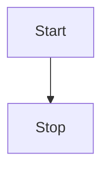

# Mermaid 图表渲染 Implementation Plan

> **For agentic workers:** REQUIRED SUB-SKILL: Use superpowers:subagent-driven-development (recommended) or superpowers:executing-plans to implement this plan task-by-task. Steps use checkbox (`- [ ]`) syntax for tracking.

**Goal:** 在阅读器中识别 GFM 围栏代码块且语言为 `mermaid`（大小写不敏感），将 DSL 安全地转为可点击阅读的矢量图：HTML 阶段输出专用占位节点，渲染进程在 `innerHTML` 注入后调用 Mermaid 在客户端生成 SVG。

**Architecture:** 在 **remark → rehype 之后、rehype-sanitize 之前** 插入小型 **rehype 插件**：把 `<pre><code class="language-mermaid">…</code></pre>` 替换为 `<div class="mermaid">…</div>`，文本子节点保留换行与 DSL 原文。扩展现有 `rehype-sanitize` schema，仅允许 `div` 携带受限的 `class`（匹配 `mermaid`），避免放宽其它标签。渲染进程在 `loadDocument` 成功写入 `#article` 后 **动态 `import('mermaid')`**，配置 `startOnLoad: false` 与较严的 `securityLevel`，对 `#article` 内 `.mermaid` 调用 `mermaid.run()`；无效 DSL 由 Mermaid 在节点内展示错误信息，不阻断整篇文档。不引入服务端渲染 Mermaid（YAGNI，与当前 Electron 渲染模型一致）。

**Tech Stack:** 既有 unified/remark/rehype/rehype-sanitize 管道；新增依赖 **`mermaid`**（渲染进程打包）；测试仍用 **Vitest**（仅断言 HTML 结构，不断言 SVG 像素）。

---

## 文件结构（落地前分解）

| 路径 | 职责 |
|------|------|
| `package.json` / `package-lock.json` | 增加运行时依赖 `mermaid` |
| `src/lib/rehype-mermaid-blocks.ts`（新建） | rehype 插件： fenced `mermaid` → `div.mermaid` + 文本内容 |
| `src/lib/render-markdown.ts` | 接入插件；扩展 sanitize schema（`div` + `class` 白名单） |
| `src/renderer/src/main.ts` | 文档加载后初始化/运行 Mermaid；刷新与重载同路径 |
| `src/renderer/src/styles.css` | `.mermaid` 容器间距、可选 `svg` 最大宽度，避免撑破栏宽 |
| `tests/render-markdown.test.ts` | 新增用例：mermaid 围栏输出 `div.mermaid`；非 mermaid 代码块仍为 `pre/code` |

---

### Task 1: 依赖 `mermaid`

**Files:**
- Modify: `package.json`
- Modify: `package-lock.json`（由安装命令生成）

- [ ] **Step 1: 安装依赖**

在工作区根目录（worktree 根目录）执行：

```bash
npm install mermaid
```

- [ ] **Step 2: 确认版本可解析**

```bash
npm ls mermaid
```

预期：树中显示 `mermaid@…` 无 `UNMET`/`invalid`。

- [ ] **Step 3: Commit**

```bash
git add package.json package-lock.json
git commit -m "chore: add mermaid for diagram rendering"
```

---

### Task 2: rehype 插件 `rehype-mermaid-blocks`

**Files:**
- Create: `src/lib/rehype-mermaid-blocks.ts`
- Test: （Task 4 再写测试，本任务先实现）

- [ ] **Step 1: 编写插件实现**

创建 `src/lib/rehype-mermaid-blocks.ts`：

```typescript
import { visit } from 'unist-util-visit'
import type { Element, Root as HastRoot, Text } from 'hast'

function languageFromClassName(className: unknown): string | null {
  if (!Array.isArray(className)) return null
  for (const c of className) {
    if (typeof c === 'string' && c.startsWith('language-')) {
      return c.slice('language-'.length).toLowerCase()
    }
  }
  return null
}

function collectText(node: Element): string {
  let out = ''
  for (const child of node.children ?? []) {
    if (child.type === 'text') {
      out += (child as Text).value
    } else if (child.type === 'element') {
      out += collectText(child as Element)
    }
  }
  return out
}

/**
 * 将 ```mermaid 围栏（rehype 中 pre > code.language-mermaid）替换为
 * Mermaid 客户端所需的 div.mermaid。
 */
export function rehypeMermaidBlocks() {
  return (tree: HastRoot) => {
    visit(tree, 'element', (node: Element, index, parent) => {
      if (node.tagName !== 'pre') return
      const code = node.children[0]
      if (!code || code.type !== 'element' || code.tagName !== 'code') return
      if (languageFromClassName(code.properties?.className) !== 'mermaid') return

      const source = collectText(code as Element)
      const replacement: Element = {
        type: 'element',
        tagName: 'div',
        properties: { className: ['mermaid'] },
        children: [{ type: 'text', value: source }]
      }

      if (parent && typeof index === 'number') {
        parent.children[index] = replacement
      }
    })
  }
}
```

- [ ] **Step 2: Typecheck（可选快速验证）**

```bash
npx tsc --noEmit -p tsconfig.web.json
```

预期：无 `rehype-mermaid-blocks` 相关报错（若工程未单独编 lib，可跳过，以 Task 3 后 `npm run build` 为准）。

- [ ] **Step 3: Commit**

```bash
git add src/lib/rehype-mermaid-blocks.ts
git commit -m "feat(rehype): convert mermaid fenced blocks to div.mermaid"
```

---

### Task 3: 接入管道并放宽 sanitize

**Files:**
- Modify: `src/lib/render-markdown.ts`

- [ ] **Step 1: 修改 `render-markdown.ts`**

在文件顶部增加：

```typescript
import { rehypeMermaidBlocks } from './rehype-mermaid-blocks'
```

将现有 `schema` 常量扩展为在展开 `defaultSchema` 后合并 `tagNames` / `attributes`（若 `defaultSchema.tagNames` 为 `undefined`，用空数组兜底）。在 **对象字面量中** 写入下列合并逻辑（保持与现有 `protocols`、`clobberPrefix` 同一 `schema` 对象内）：

```typescript
const schema = {
  ...defaultSchema,
  clobberPrefix: '',
  tagNames: [...(defaultSchema.tagNames ?? []), 'div'],
  attributes: {
    ...defaultSchema.attributes,
    div: [
      ...(defaultSchema.attributes?.div ?? []),
      ['className', /^mermaid$/]
    ]
  },
  protocols: {
    ...defaultSchema.protocols,
    src: [...(defaultSchema.protocols?.src ?? []), 'http', 'https', 'file', 'data'],
    href: [...(defaultSchema.protocols?.href ?? []), 'http', 'https', 'file', 'mailto']
  }
}
```

在 `unified()` 链中，于 `.use(remarkRehype, { allowDangerousHtml: false })` **之后**、图片改写 **之前** 插入：

```typescript
    .use(rehypeMermaidBlocks)
```

完整链片段应为：`remarkParse` → `remarkGfm` → `remarkRehype` → **`rehypeMermaidBlocks`** → 匿名 `rewriteImageSrc` → `rehypeSlug` → `rehypeSanitize` → `rehypeStringify`。

- [ ] **Step 2: Commit**

```bash
git add src/lib/render-markdown.ts
git commit -m "feat(render): pipe mermaid blocks through sanitize"
```

---

### Task 4: Vitest — HTML 输出含 `div.mermaid`

**Files:**
- Modify: `tests/render-markdown.test.ts`

- [ ] **Step 1: 写入失败测试**

在 `tests/render-markdown.test.ts` 的 `describe('renderMarkdownToHtml', () => {` 内追加：

```typescript
  it('turns mermaid fenced block into div.mermaid with diagram source', async () => {
    const md = '```mermaid\nflowchart LR\n  A --> B\n```\n'
    const html = await renderMarkdownToHtml(md, { baseDir: null })
    expect(html).toContain('class="mermaid"')
    expect(html).toContain('flowchart LR')
    expect(html).toContain('A --> B')
    expect(html.toLowerCase()).not.toContain('language-mermaid')
  })

  it('leaves non-mermaid fenced code as pre/code', async () => {
    const md = '```js\nconst x = 1\n```\n'
    const html = await renderMarkdownToHtml(md, { baseDir: null })
    expect(html).toContain('<pre>')
    expect(html).toContain('language-js')
    expect(html).not.toContain('class="mermaid"')
  })
```

- [ ] **Step 2: 运行测试（应先通过，因 Task 2–3 已实现）**

```bash
npm run test -- tests/render-markdown.test.ts
```

预期：上述两条 `PASS`。

若 **`div` 被 sanitize 整节点移除** 导致失败：回到 `render-markdown.ts` 核对 `tagNames`/`attributes` 是否与 `rehype-sanitize` v6 的 `defaultSchema` 形状一致（必要时打印 `Object.keys(defaultSchema)` 调试），修正后再跑同一命令直至 `PASS`。

- [ ] **Step 3: Commit**

```bash
git add tests/render-markdown.test.ts
git commit -m "test(render): cover mermaid fenced block HTML output"
```

---

### Task 5: 渲染进程运行 Mermaid

**Files:**
- Modify: `src/renderer/src/main.ts`

- [ ] **Step 1: 添加运行函数**

在 `src/renderer/src/main.ts` 中、顶层 `import` 之后增加：

```typescript
let mermaidReady = false

async function runMermaidInArticle(): Promise<void> {
  const article = document.querySelector('#article') as HTMLElement | null
  if (!article) return
  const blocks = article.querySelectorAll('div.mermaid')
  if (blocks.length === 0) return

  const mermaid = (await import('mermaid')).default
  if (!mermaidReady) {
    mermaid.initialize({
      startOnLoad: false,
      securityLevel: 'strict',
      theme: window.matchMedia('(prefers-color-scheme: dark)').matches ? 'dark' : 'default'
    })
    mermaidReady = true
  }

  try {
    await mermaid.run({ nodes: [...blocks] })
  } catch {
    // Mermaid 已在节点内展示错误；避免未处理 Promise 影响 DevTools
  }
}
```

- [ ] **Step 2: 在 `loadDocument` 成功渲染后调用**

在 `loadDocument` 内，`elArticle.innerHTML = html` 与 `buildOutline(result.markdown)` **之后**、注册 `scroll` 之前插入：

```typescript
  await runMermaidInArticle()
```

使 `loadDocument` 在成功路径上为 `async` 已满足；错误/空文档分支**不要**调用 `runMermaidInArticle`。

- [ ] **Step 3: 手动验证**

```bash
npm run dev
```

打开含下列内容的 `.md` 文件：

````markdown

````

预期：`#article` 内出现 SVG 流程图；控制台无未捕获异常。再试故意错误 DSL，预期节点附近出现 Mermaid 错误提示、应用不崩溃。

- [ ] **Step 4: Commit**

```bash
git add src/renderer/src/main.ts
git commit -m "feat(renderer): run mermaid on article after markdown html"
```

---

### Task 6: 阅读区样式（防撑版）

**Files:**
- Modify: `src/renderer/src/styles.css`

- [ ] **Step 1: 追加样式**

在 `src/renderer/src/styles.css` 末尾追加：

```css
.article .mermaid {
  margin: 1rem 0;
  overflow-x: auto;
}

.article .mermaid svg {
  max-width: 100%;
  height: auto;
}
```

- [ ] **Step 2: Commit**

```bash
git add src/renderer/src/styles.css
git commit -m "style: constrain mermaid svg width in article"
```

---

## 自检（计划作者自检结果）

**1. Spec 覆盖**

| 需求 | 对应任务 |
|------|----------|
| 支持 Mermaid 语言并渲染为图 | Task 2–3（占位）+ Task 5（客户端成图） |
| 围栏代码块语法（GFM） | Task 2 基于 `language-mermaid` |
| 安全（不放宽脚本、不扩大 HTML 注入） | Task 3 仅 `div` + `class` 白名单；保持 `allowDangerousHtml: false` |
| 可测试交付 | Task 4 Vitest |

**2. 占位符扫描**

已检查：无 TBD/TODO/「适当处理」类空洞步骤；测试与命令均具体。

**3. 类型与 API 一致性**

`rehype-mermaid-blocks` 使用 hast `Element`/`Text`；`mermaid.run({ nodes })` 与 Mermaid 10+ 文档一致；若实际安装 major 与示例不兼容，以实现时 `node_modules/mermaid` 的类型或 README 为准调整 `initialize`/`run` 调用（仍保持 `startOnLoad: false`）。

---

## 执行交接

**计划已保存到 `docs/superpowers/plans/2026-04-06-mermaid-diagram-support.md`。可选执行方式：**

1. **Subagent-Driven（推荐）** — 每任务派生子代理，任务间人工复核，迭代快。  
2. **Inline Execution** — 本会话按任务批量执行，检查点停顿复核。

**请选择其一。**  
若选 Subagent-Driven：**必须**配合使用 `subagent-driven-development` 技能；若选 Inline：**必须**配合使用 `executing-plans` 技能。
